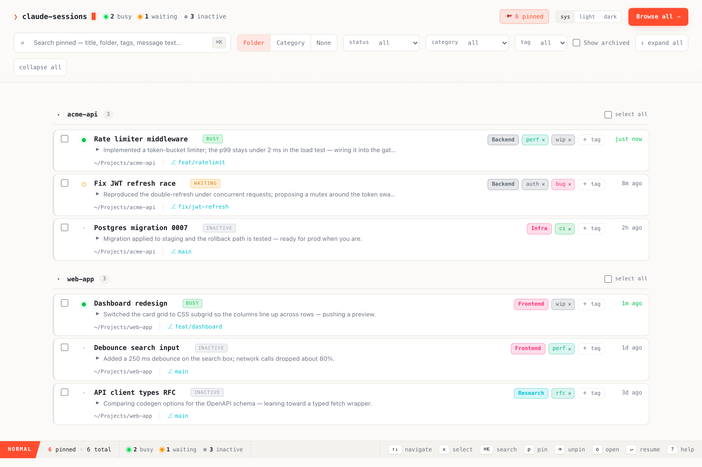

# claude-sessions

A local dashboard to browse, organize, and resume your Claude Code sessions —
a small, self-contained binary that reads what Claude Code already writes to
disk and gives you a curated workspace on top of it.



> Screenshot uses fabricated data. The capture is regenerable — see
> [`docs/capture/`](docs/capture/).

It reads Claude Code's own files under `~/.claude` **read-only** (`projects/`
transcripts and `sessions/` live status) and stores *your* organization (pins,
categories, tags, archive, custom titles) in a separate sidecar at
`~/.claude/session-ui/meta.json`. It never modifies Claude Code's data.

## Features

- **Pinned workspace** (home) you curate, plus a **Browse all** modal to discover
  and pin from every session.
- Live **status** — busy / waiting / inactive — derived from the running Claude
  Code processes, with a one-line **last-message preview** per session.
- **Full-text search** across entire conversation content, with the matched terms
  highlighted in a snippet (not just titles).
- Notion-style **category** (single-select) and **tags** (multi-select), with
  deterministic colors; rename a session inline (stored in the sidecar).
- **Folders** (by working directory), collapsible groups, **archive**, and bulk
  actions (open / archive / move-to-category / unpin).
- **Open** selected sessions straight into Ghostty splits (`claude --resume`).
- Keyboard-driven, right-click context menu, light / dark / system theme.

### Keyboard shortcuts

| Key | Action | | Key | Action |
|---|---|---|---|---|
| `↑` `↓` / `j` `k` | move focus | | `⌘K` / `/` | search |
| `space` / `x` | select | | `b` | browse all |
| `enter` / `o` | open / resume | | `?` | shortcuts help |
| `p` | pin | | `⌫` | unpin (with confirm) |

A row click also moves the focus; right-click opens a context menu.

## Stack

- **Backend** — Rust + axum: session discovery, live status, the metadata
  sidecar, concurrent full-text search, and the Ghostty "open" logic; serves the
  JSON API **and** the embedded SPA as one binary (`backend/`).
- **Frontend** — Svelte 5 + Vite + TypeScript + Tailwind, built to
  `frontend/dist` and embedded into the binary via `rust-embed` (`frontend/`).

Dependencies are pinned and lockfiles committed; the frontend uses pnpm with a
30-day release-age cooldown (`frontend/.npmrc`).

## Build & run

```sh
# build the SPA (only when the frontend changes), then the binary
pnpm -C frontend install
pnpm -C frontend build
cargo build --release --manifest-path backend/Cargo.toml --locked

# run — serves http://127.0.0.1:7799
./backend/target/release/ccs            # or --addr 127.0.0.1:PORT
```

Frontend dev with hot reload (proxies `/api` to a backend running on :7799):

```sh
pnpm -C frontend dev
```

## Opening sessions (macOS / Ghostty)

Ghostty has no CLI to create a split that runs a command, so **Open** drives the
native splits via AppleScript: for each session it sends `⌘D` (split), pastes
`cd <cwd> && claude --resume <id>` (pasting, not typing, so long commands aren't
mangled), and `⌘⌃=` to keep the panes even. The first use prompts to allow the
controlling app under **System Settings → Privacy & Security → Accessibility**.

## Config

Optional user config at `~/.claude/session-ui/config.toml` (honors
`CLAUDE_CONFIG_DIR`). All keys are optional — defaults shown:

```toml
resume_program = "claude"   # launcher; e.g. "cc" for an alias adding bypass flags
equalize       = true       # rebalance splits (⌘⌃=) after each
split_down     = false      # stack splits vertically (⌘⇧D) instead of side-by-side
split_delay    = 0.45       # seconds to wait after each split before pasting
```

The resume invocation is `<resume_program> --resume <id>`, so you only set the
program — not the whole command.

## License

[MIT](LICENSE)
